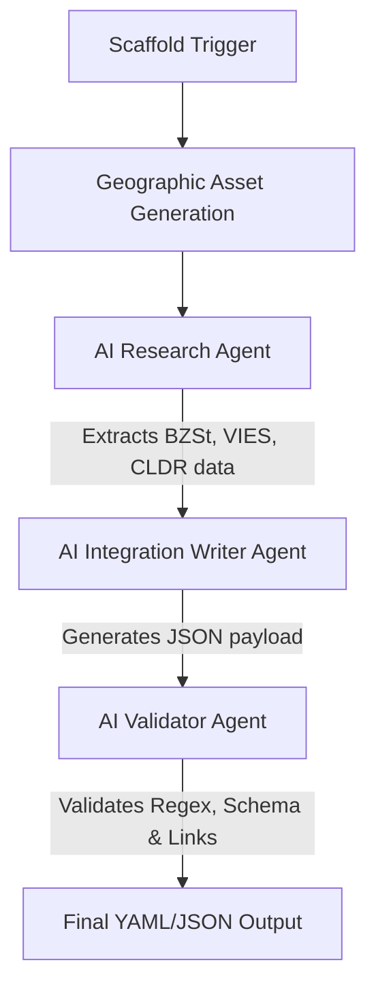

# Architectural Proposal: Country Hub Platform V2

This document details the architectural design and evolution strategy to transition the current country hubs from a manual/semi-automated scripting model to a fully automated, AI-first platform pipeline.

---

## 1. Current Architecture

Currently, the Country Hub generation operates on a hybrid model of automated geographic math and manual configuration updates:

1. **CLI Scaffolder (`create-country-hub.mjs`)**:
   - Parses arguments and performs duplicate checks for ID and ISO codes.
   - Extracts geometry coordinates from `world-map-source.svg` based on ID.
   - Centers the outline SVG, applies scale/translation matrix transforms, and generates location maps.
   - Projects raw coordinates into the Portal map coordinate space using linear regression residuals.
   - Inserts placeholders into `COUNTRY_VISUAL_ASSETS`, `COUNTRY_HUBS`, and `COUNTRY_PORTAL_CATALOG` in `countries.js` using Node's VM context for structural validation.
2. **Central Registry (`countries.js`)**:
   - A single, monolithic JavaScript configuration file (currently ~2,600 lines) holding all visual paths, meta profiles, validation rules, localized formatting conventions, payment systems, and planned workbenches.
3. **Static Page Compilation (Valido Engine)**:
   - A Java-based static page publisher reading YAML profiles (e.g. `countries/germany.yaml`) and mapping them into HTML routes, using client-side JavaScript (`countries.js`) to dynamic-render the content area.

---

## 2. Pain Points

As the platform scales to 50+ countries, several structural bottlenecks emerge:

1. **Monolithic Configuration (`countries.js`)**:
   - Storing all data in one large JavaScript file will eventually lead to a file exceeding 30,000 lines. This is fragile to merge, slow to parse by the browser, and prone to syntax breakage on manual edits.
2. **Repetitive Manual Research & Copy-Paste**:
   - Local formats (Steuer-ID, NIF, CIF, Bizum, REGON), payment systems, official resources, quick actions, validation rules, localized currency spacing, and developer examples must be researched and updated manually.
3. **Hardcoded Asset Math Overrides**:
   - Precise coordinates (like Berlin or Warsaw markers) require manual `--capital` CLI inputs or geographic guesses.
4. **Divided Data Sources**:
   - Route metadata is divided between YAML (`countries/germany.yaml`), JS (`assets/js/countries.js`), and SVG assets.

---

## 3. Automation Opportunities

To achieve a 95% automated pipeline, V2 will introduce the following decoupling and generation patterns:

1. **Decoupled Data Architecture (YAML/JSON First)**:
   - Remove `COUNTRY_HUBS` and `COUNTRY_PORTAL_CATALOG` from the code. Move each country's metadata and visual specification into an isolated, schema-validated JSON/YAML document (e.g., `countries/data/italy.json`).
   - At build time, a script aggregates these documents into a compressed client-side payload, keeping source control clean and atomic.
2. **Automated Capital & Coordinate Lookup**:
   - Integrate a lightweight geographic mapping database (e.g., using open-source packages or city coordinates from Natural Earth populated places dataset) to automatically resolve capital locations in the SVG space without CLI overrides.
3. **Automatic Palette Extraction**:
   - Automatically extract flag palettes and compute BCP-47 compliant typography colors, contrast ratios, and pastel stops.

---

## 4. AI Pipeline

Rather than relying on human engineers to write documentation copy, V2 incorporates a structured, schema-enforced LLM generation step:



### AI Agent Roles:
1. **Research Agent**: Query official APIs (e.g., CLDR repository, ISO lists, VIES, BZSt) to extract exact validation regex patterns, character lengths, and phone formats.
2. **Integration Writer**: Drafts copy-ready code snippets (Java, JS, Python, Go, Rust), localized address examples, checklists, and common developer pitfalls.
3. **Validator Agent**: Runs local checks on generated regex and checks for broken reference URLs.

---

## 5. Scaffolder V2

The CLI will evolve to split visual generation from content writing:

```bash
# Basic Scaffold (Visual assets + JSON stub only)
node scripts/create-country-hub.mjs --id italy --iso2 IT --iso3 ITA

# Full AI-Enriched Scaffolding
node scripts/create-country-hub.mjs --id italy --ai-enrich
```

- **Output**: Produces `countries/data/italy.json` containing visual markers, palette metrics, metadata details, stats, validation checklists, and payment systems, all conforming to a strict JSON Schema.

---

## 6. Asset Pipeline V2

- **Dynamic Crops**: Automatically compute the optimal `4:3` bounding box crop of the target country and surrounding neighbors using geographic geometry buffers.
- **Auto-Theming**: Generate outline card gradients and drop shadow color coordinates automatically by mapping the theme's colors into an HSL-derived contrast scale.
- **Dark Mode Support**: Automatically output inline SVG variables representing light and dark mode state.

---

## 7. Content Pipeline V2

V2 standardizes localized sections to prevent content drift:

- **Strict Schema Enforcement**: Schema defines exactly what properties are allowed. Every entry must declare a `type`, `category`, `status`, and BCP-47 `language` tag.
- **Multi-language Snippets**: Generate standard, copy-ready developer code snippets across standard web backends (Node.js, Java, Python, Go, PHP, Rust, C#).

---

## 8. Validation Pipeline

Before a country hub can be set to `available`, it must pass a strict programmatic validation pipeline:

1. **Schema Check**: Validates `italy.json` against the central JSON Schema.
2. **Regex Compilation**: Compiles and tests every generated regex format validation check against valid and invalid fixtures.
3. **Link Auditor**: Crawls official resources to ensure no links are dead.
4. **Visual Asset Audit**: Confirms that both location and outline SVGs are valid, referenceable, and have matching element IDs.
5. **No Regression Assertions**: Validates that Spain, Brazil, Poland, and Germany hashes remain unchanged.

---

## 9. Promotion Workflow

To ensure high visual and content quality, country hubs move through five explicit states:

1. **Draft**: Initial entry added to catalog; metadata is empty.
2. **Scaffolded**: SVGs and JSON structure generated; visual assets verified.
3. **AI-Enriched**: Detailed contents generated and populated by the LLM pipeline.
4. **Validated**: Programmatic tests (regex, links, schema) pass in CI.
5. **Available**: Promoted to public routes and linked in Countries Portal after manual visual sign-off.

---

## 10. Long-Term Vision (50+ Countries)

With 50+ countries, the Country Hub Platform becomes a highly performant, distributed, and zero-maintenance knowledge base:

- **Country Hubs Registry API**: Rather than static imports, profiles can be loaded asynchronously, reducing initial load times for the portal page.
- **Automated Re-validation**: A weekly cron job runs the validator suite, checking for registry format changes (e.g. EU VAT rule modifications) or broken official links, alerting developers before integrations fail.
- **Developer Playground Integration**: Link country-specific validator regexes directly to a live, interactive web workbench.
