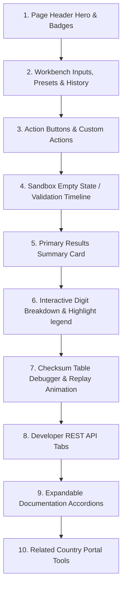

# Gold Standard Reference: PESEL Validator

The **Polish PESEL Validator & Explainer** is the canonical UI, UX, and architectural benchmark for the entire ValidoHub platform. It represents **Version 1.0 of the Gold Standard**.

> [!IMPORTANT]
> **PESEL IS FROZEN.**
> Do not modify the PESEL page structure, layout, styles, or logic. Any new tool or refactoring must match the quality of this implementation. Future tools may improve the experience, but they must NEVER provide a worse one.

---

## 1. Why PESEL is the Reference
The PESEL page establishes the blueprint for ValidoHub's visual and interactive architecture by combining:
1. **Interactive Inputs:** Presets and History selects are prepended inside the main grid, and Generator chips sit directly above primary actions.
2. **Local Sandbox Indicators:** The page explicitly states that processing occurs in the browser sandbox.
3. **Decoupled Validation Pipeline:** Feedback is mapped as a visual timeline tracking discrete validation stages.
4. **Visual Highlights & Legend Hovers:** Digits and explanations share bidirectional hovering relationships.
5. **Progressive Mathematical Debugger:** Calculations are animated through progressive weight multiplications.
6. **Tabs-Based REST API Preview:** Syntaxes for multiple languages (cURL, JS, Python, Java, C#, Go) are shown side-by-side.

---

## 2. Page Hierarchy & Layout Map

---

## 3. Detailed Component Walkthroughs

### Page Header Hero
* **Title:** Concise title (`PESEL Validator & Explainer`).
* **Badges:** Stripe-quality tags defining capability scope (`🔒 Local Sandbox`, `✓ Privacy Guaranteed`, etc.).

### Presets and History Placements
* **Grid Layout:** Integrated inside `.field-grid` directly.
  * Presets (50% width) and History (50% width) occupy Row 1.
  * The main text input field occupies Row 2, spanning 100% of the grid (`gridColumn: 1 / -1`).
* **Interaction:** Selecting any preset immediately updates the input field and triggers validation without page reload.

### Sandbox Empty State
* Visible when the input is empty. Displays a lock icon, reassuring the user that no network queries are sent.

### Validation Timeline
* Connecting nodes (`Input -> Regex -> Length -> Century -> Calendar -> Checksum`) that update in real time. Red or green status node states immediately show where a payload failed verification.

### Interactive Breakdown Legends
* Digits are displayed as separate boxes. Hovering over a digit group (e.g., YY, MM, DD, Serial, Checksum) highlights the relevant cell group, updates the active outline color, and outputs a clear metadata card explaining the parsed encoding rules.

### Checksum Debugger Loop
* Displays weights, products, and running sums inside a clean monospace matrix table. Clicking the `▶ Replay` button triggers an animation that sweeps rows sequentially (every 120ms) and reveals final modulo equations.
